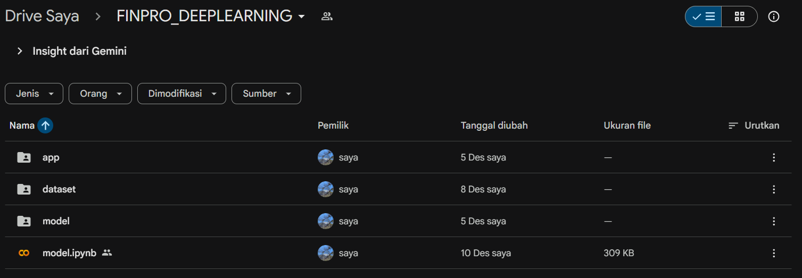
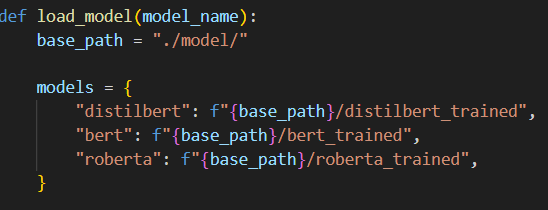
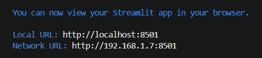

# DEEP LEARNING FINAL PROJECT
# Mental Health Text Classification using DistilBERT, BERT, and RoBERTa

## Full google drive link:
🔗 [FINALPROJECT_DEEPLEARNING](https://drive.google.com/drive/folders/1jcaEpzCvAloIWYjkwoNsH087PG773ei-?usp=sharing)

---

This project aims to **predict mental health categories from user-written text** using three state-of-the-art Transformer models:

- **DistilBERT**
- **BERT-base**
- **RoBERTa-base**

The app classifies text into **7 mental health condition labels**:
```
0: "Normal"
1: "Depression"
2: "Suicidal"
3: "Anxiety"
4: "Bipolar"
5: "Stress"
6: "Personality Disorder"
```
This project includes **dataset preprocessing**, **model training**, **evaluation**, and a **streamlit web app (ran locally or on cloudfare in google colab)**.


## 🎯 Project Goals

This project was built to:

- Detect mental health predictions/indications from user input (written text)
- Compare model performance (DistilBERT vs BERT vs RoBERTa)  
- Evaluate classification quality using F1-score and confusion matrix  
- Deploy an interactive demo using Streamlit  


## 🧠 Model Overview

### **DistilBERT**
- a lighter and faster version of BERT  
- 40% smaller, 60% faster    
- Works best for **real-time applications**

### **BERT-base**
- has a strong semantic understanding  
- good for complex text reasoning  
- more expensive (computationally)

### **RoBERTa-base**
- Optimized BERT (longer training, dynamic masking, larger batches)  
- Often achieves the highest accuracy 
- Most robust among the other 3

---

## Dataset Overview

The dataset used in this project is located externally on Google Drive and is not included directly in this repository.

🔗 **Dataset Access Link:**  
[https://drive.google.com/drive/folders/1WFwNkBf3vp8r4-0HuUbgXnxXZAL2pHko?usp=sharing](https://drive.google.com/drive/folders/1WFwNkBf3vp8r4-0HuUbgXnxXZAL2pHko?usp=sharing)


### How to Use the Dataset

1. Download the dataset (**"mental_health_dataset_augmented.csv"**) from the Google Drive link.
2. Extract and place the files into the `dataset/` folder.
3. Ensure the dataset structure matches the expected format in the code.

---

### Dataset Usage

The dataset is used for:
- Fine-tuning pretrained Transformer models
- Comparing model performance (BERT, DistilBERT, RoBERTa)
- Evaluating classification metrics 

---


## 🧪 Model Training & Evaluation

The notebook `model.ipynb` includes:

- Data cleaning  
- Tokenization  
- Fine-tuning all 3 models  
- Saving trained models  
- Evaluating using:
  - Classification report  
  - Confusion matrix  
  - Macro F1-score  
- Loss comparison (training & validation via forward pass)

To view more detail, see the code:  
📄 **[model.ipynb](model.ipynb)**

---

## 🚀 Running the Streamlit App (on google colab or locally)
> It is recommended to run this app on Google Colab, as the application, training process was also made fully in Google Colab

### **FOR GOOGLE COLAB**
‼️ **PLEASE ENSURE THE FILE STRUCTURE IS AS BELOW:**
```
deeplearning_finalproject/
│
├── app/
│   └── app.py
│
├── model/
│   ├── distilbert_trained/
│   │   ├── config.json
│   │   ├── model.safetensors 
│   │   └── tokenizer.json
│   │   └── etc..
│   │
│   ├── bert_trained/
│   └── roberta_trained/
│
├── dataset/
│   └── mental_health_dataset_augmented.csv
│
└── model.ipynb
```



Then, run the app by launching the app.py (or preferably app.ipynb, and execute all cell), include installing cloudfare & running the streamlit:
```
!wget https://github.com/cloudflare/cloudflared/releases/latest/download/cloudflared-linux-amd64.deb

!dpkg -i cloudflared-linux-amd64.deb

!streamlit run /content/drive/MyDrive/FINPRO_DEEPLEARNING/app/app.py --server.port 8501 &>/dev/null &

!cloudflared tunnel --url http://localhost:8501 --no-autoupdate
```

After running the tunnel, it will show a link to access the streamlit app (usually in a format of xxx.trycloudfare.com)


### **RUN ON LOCAL**

###  **1. CLONE REPO**
```
git clone https://github.com/nyxuuo/deeplearning_finalproject.git
cd deeplearning_finalproject
```

or clone using Github Desktop

### **2. Make Virtual Env and Install dependencies**
First, make the environment:
```
python -m venv venv
venv\Scripts\activate

```
then install dependencies
```
pip install streamlit torch transformers streamlit pandas numpy skicit-learn matplotlib seaborn tqdm
```

or a way more recommended way is to install from file: **[requirements.txt](requirements.txt)**
if you use **requirements.txt:**
```
pip install -r requirements.txt
```

## **3. Download MODEL from Google Drive**
[Click here to download the model](https://drive.google.com/drive/folders/1-_lgZsWNAplRe4scNaO6M1VHPd1mWBHp?usp=sharing)

‼️ **IMPORTANT:** File structure must be made like this:
```
deeplearning_finalproject/
│
├── app/
│   └── app.py
│
├── model/
│   ├── distilbert_trained/
│   │   ├── config.json
│   │   ├── model.safetensors 
│   │   └── tokenizer.json
│   │   └── etc..
│   │
│   ├── bert_trained/
│   └── roberta_trained/
│
├── dataset/
│   └── mental_health_dataset_augmented.csv
│
└── model.ipynb
```
...and the model name should be the same (don't edit the model name!)

## **4. Check & adjust the path in app/app.py**
The path should be like this if ran locally:


### **5. Run the app**
Run the app by running
``` 
streamlit run app/app.py
```
on the **root project** file!

if it can't run in the root project, use:
```
python -m streamlit run app/app.py
```
inside (venv) path

It will show a **Local URL**, and can be accessed.


---
## 🎥 Short App Demo


---
## 🎬 Full Video & App Demonstration
[Demo App](https://drive.google.com/drive/folders/1qVa1L8_-RXb919c04XzT7pF-TYnnpRDs?usp=sharing)
